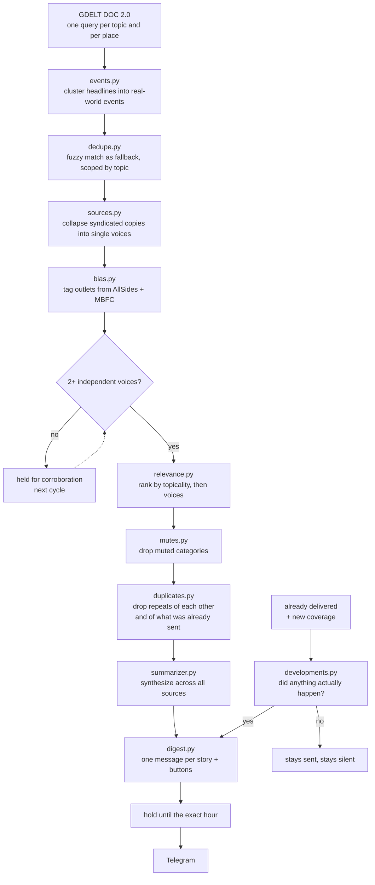

# telegram-news-collector

A personal news digest that arrives on Telegram every four hours, on the hour.

It pulls candidate articles from GDELT for the topics and places you follow, clusters
them into real-world events, discards anything only one newsroom reported, writes a
summary that synthesizes across the outlets that did report it, and shows you how the
coverage splits across the political spectrum. You can tap **Ask** under any story to ask
a follow-up question, answered with live web search, or just message the bot to start
tracking something new.

```
📰  News  ·  Tue 11 Aug  ·  8:00am
━━━━━━━━━━━━━━━━━━

🛡  Iran war  ·  7 voices

▌ Iran is demanding additional U.S. concessions as a
▌ condition for reopening the Strait of Hormuz,
▌ according to regional media.

Reuters · Al Jazeera · Fox News · The Guardian  +3 more
🟦🟦⬜🟥🟥  leans Left

[ Follow ]  [ Ask ]  [ Ignore ]
```

---

## The interesting part

Fetching news and summarizing it is a weekend project. Most of the work here went into
the problems that only appear once it's actually running, each of which turned out to
contradict the obvious approach.

### Nine sources can be one source

The digest promises corroboration: a story appears only if at least two independent
outlets reported it. The obvious implementation — count distinct domains — is wrong, and
measurably so. On real data, the single most "corroborated" story in the database had
**nine distinct domains and exactly one distinct headline**: `wxii12`, `wlwt`, `wisn`,
`wyff4` and five others are all Hearst Television affiliates running the same wire copy.
Reach plc does it across the UK, the Fox O&O group does it in the US, and one live digest
turned out to have three of its eight stories built on Southern California News Group
reprints.

Syndicated copies also cannot disagree with each other, so the summarizer has nothing to
synthesize and the coverage breakdown reports a consensus that never happened.

[`sources.py`](news_alert/sources.py) collapses sources by headline similarity so each
group votes once. A subtlety that took a second pass: publisher chains append their own
masthead — *"Art the Clown takes over Universal Terror Tram – Press Telegram"* — which
dragged five identical copies from a similarity of ~100 down to 75, under the collapse
threshold, so they counted as five independent outlets. Stripping the trailing masthead
first puts them back where they belong. On a recent run this collapsed 21 domains into 7
real voices, and 19 into 4.

### Rate limits that aren't about you

GDELT returns HTTP 429 constantly, and the reflex is exponential backoff. That reflex
assumes a 429 means *you* are going too fast, so waiting longer helps.

Measured: ten identical requests at six-second spacing, from an otherwise idle host,
returned **nine 429s and one 200** — and a first request after minutes of silence still
429s. The API is saturated and answers probabilistically. A longer wait is no likelier to
succeed than a short one; it just burns the delivery window.

So [`fetcher.py`](news_alert/fetcher.py) does the opposite of the convention: **many
attempts, short flat waits**. Same reasoning applies to the HTTP timeout — in one sample
the single successful response was the *slowest* of the batch at 13.7s, so shortening the
timeout would sever precisely the requests that were about to succeed.

### Two newsrooms, one event, no shared words

With syndication collapsed, genuine corroboration nearly vanished — **1.2%** of stories
reached two independent sources. The cause was upstream: matching clustered on headline
similarity, which can only ever group near-identical text. That is a syndication
detector, not an event detector. Three separate stories about Iran appointing Mohsen
Rezaei sat in three separate clusters, scoring 44–67 against each other while syndicated
copies scored ~100. No threshold separates those two populations, and lowering it just
invites false merges.

[`events.py`](news_alert/events.py) groups a run's headlines by real-world event using one
Haiku call per 40-headline chunk, before the fuzzy matcher, which stays underneath as a
fallback. Corroboration went **1.2% → 14.1%** on identical input.

The prompt is written defensively, because the failure mode is asymmetric: an
over-eager grouper merges unrelated news into one story, which is far worse than missing
a link. It's told explicitly that most headlines in a batch belong to no group but
themselves.

### Coverage spread, not a verdict

Rather than labelling a story with one outlet's bias, the digest shows the distribution —
how many Left, Center and Right outlets carried it — with the overall lean derived from
that spread. Ratings come from AllSides layered with a Media Bias/Fact Check-derived
dataset covering 8,774 domains, with alias and subdomain normalization
(`edition.cnn.com` → `cnn.com`).

Two deliberate constraints in [`bias.py`](news_alert/bias.py): outlets in neither dataset
are **never guessed at** — they're excluded from the math but still appear as source links
— and the word "Unrated" never renders. A story with too few rated sources simply gets no
coverage line, because a confident-looking bar built on one rating is worse than no bar.

### Most of what a search returns isn't about the search

GDELT matches a query against an article's full text, not its subject, so `California`
returns anything mentioning California once in passing. Measured across a day of live
fetches, the share of headlines actually about the term searched:

| search term | headlines | on topic |
|---|---:|---:|
| Iran war | 478 | 32.8% |
| cybersecurity | 431 | 22.0% |
| California | 1150 | 10.4% |
| Hawaii | 105 | 4.8% |

The obvious fix is to require the term in the headline. Replayed against real digests,
that would have **dropped 11 of 16 delivered stories** — and it drops true positives, since
*"Four U.S. states are suing Meta"* is the California case and never says so. Because the
two-source rule already limits supply to roughly eight stories per run, a precision gate
starves the digest and starts padding it with single-source filler, which is worse than an
off-topic story sitting at the bottom.

So [`relevance.py`](news_alert/relevance.py) produces a **ranking** signal, not a filter:
on-topic stories sort to the top and drift fills what's left.

### Landing on the hour

The fetch takes anywhere from one to thirteen minutes depending purely on how GDELT feels,
so a job that starts at 8:00 delivers whenever it finishes — one 8pm digest arrived at
8:26pm. The scheduler instead starts 15 minutes early and the finished digest **waits** for
the target instant, so the variable part happens inside the lead. Recent digests landed at
`11:00:00`, `15:00:00` and `19:00:00` UTC exactly.

---

## How it fits together



A story that arrives with one source isn't discarded — it's held, and ships in a later
digest once another newsroom picks it up.

### Nothing arrives twice

Two separate mechanisms send you the same story again, and both look like features until
you're on the receiving end.

The first is structural. Events are grouped **per search term**, because the grouper has
to be scoped somewhere and cross-topic grouping invites false merges. So one event that
matches two of your terms is grouped twice, becomes two story rows that can never see each
other, and both clear the corroboration bar independently. One Powerball drawing went out
twice in a single digest, worded differently, with different source lists. `duplicates.py`
catches this at the other end of the pipeline, on the shortlist about to be sent, where
comparing across topics is cheap — and against what was sent recently, which is the same
bug spread across digests instead of within one.

The second was a deliberate feature: a story sent with one source came back once it earned
a second, marked *"Now corroborated"*. That is a fact about our confidence, not about the
news. From the reading end it is the same story twice. Now a delivered story returns only
when something **happened** — `developments.py` compares what you were told against what
has arrived since, and more outlets running the same piece, a recap, or a reaction column
all count as nothing happening. That gate covers followed stories too: following means you
want the developments, not a ping every time a wire story is republished.

## Stack

Python 3.9+, SQLite, [APScheduler](https://apscheduler.readthedocs.io/),
[rapidfuzz](https://github.com/rapidfuzz/RapidFuzz), the Telegram Bot API over plain
`requests`, and the Anthropic API — Haiku for the high-volume passes (event grouping,
summaries, intent routing) and Sonnet with web search for follow-up questions and deeper
briefings. Runs as a single systemd service on a small always-on VM.

## Setup

```bash
git clone https://github.com/thisisnickduncan/telegram-news-collector.git
cd telegram-news-collector
python -m venv venv
source venv/bin/activate     # Windows: venv\Scripts\activate
pip install -r requirements.txt
```

You'll need a Telegram bot token from [@BotFather](https://t.me/BotFather) and an
[Anthropic API key](https://console.anthropic.com/). Copy `.env.example` to `.env` and
fill them in.

```bash
python scripts/init_db.py                                    # create the schema
python scripts/set_preferences.py --topics "ai regulation,cybersecurity" --regions "US,Global"
python scripts/seed_bias_data.py                             # AllSides + MBFC ratings
python scripts/register_bot.py                               # then message your bot
```

`register_bot.py` polls for your next message and stores that chat id. It's the only chat
the bot will ever respond to — every other update is dropped, and if no chat id is
registered the bot answers no one.

## Running

```bash
python news_alert/bot_runner.py     # scheduler + Telegram polling, the real entrypoint
python news_alert/pipeline.py       # a single fetch→send pass, no scheduler
```

Only one instance may run against a given bot token — `bot_runner.py` is the single
authoritative long-poller, and a second one silently steals updates from the first.

## Deployment

`deploy/deploy.sh` uploads, relabels for SELinux, optionally migrates, and restarts,
taking the target host from `NEWS_ALERT_HOST` or a gitignored `deploy/target.env`. The
step order matters and the reasoning is in the script's header — particularly
`restorecon`, since files uploaded via `/tmp` keep the `user_tmp_t` type when copied into
`/opt`, after which the confined service cannot read its own source and fails to start
with an error that looks nothing like a labeling problem.

## Layout

```
news_alert/
  fetcher.py           GDELT DOC 2.0 pull; saturation-aware retries, English-only
  events.py            semantic event clustering (Haiku), runs before fuzzy matching
  dedupe.py            fuzzy fallback matcher, scoped by topic
  sources.py           syndication collapse — the "nine domains, one voice" problem
  relevance.py         topicality scoring used for ranking, never filtering
  bias.py              AllSides + MBFC tagging, coverage spread and overall lean
  duplicates.py        one event, two search terms, two story rows — caught on the shortlist
  developments.py      has a story you were already sent actually moved?
  mutes.py             "stop showing me these", as a category rather than keywords
  summarizer.py        cross-source summaries; deeper briefings via web search
  digest.py            builds the Telegram messages and their inline keyboards
  pipeline.py          orchestrates one run: fetch → … → hold → send
  bot_runner.py        long-poll + scheduler process, with the owner-only gate
  telegram_client.py   thin Bot API wrapper
  callback_handler.py  Follow / Ask / Ignore button presses
  message_handler.py   free-text intent routing: deep dive, new topic, mute reason, or Q&A
  deep_dive.py         records what each digest contained, for "the Iran one" to resolve against
scripts/               init_db, set_preferences, register_bot, seed_bias_data, migrate_v2..v4
deploy/                systemd unit, journald caps, deploy.sh
db/schema.sql
```

## Notes

- Topics and places are queried **independently**, never crossed. The original design
  crossed them, turning 4 topics × 3 regions into 12 queries — mostly nonsense like
  `"Iran war" Hawaii` — and since every doomed query still burned a full retry cycle, one
  run took 26 minutes end to end.
- Country filtering uses GDELT's `sourcecountry:` operator, which takes **FIPS 10-4**
  codes rather than ISO 3166 — Germany is `GM`, not `DE`. Places without a code (a state,
  a city) stay plain keyword searches rather than being guessed at.
- Queries are restricted to English sources. Without that, unreadable headlines reach the
  digest: the summarizer can't write an English summary from Turkish headlines, and it
  tends to narrate its confusion instead of refusing.
